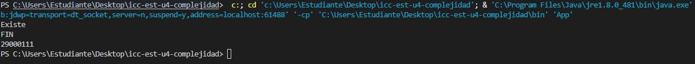

# Práctica: 04.01 Complejidad Proyecto JAVA

## Datos del Estudiante
- **Nombre:**   Martin Amaya
- **Curso:**    Estructura de Datos G2
- **Fecha:**    15/04/2026

---

## 1. icc-est-u4-complejidad

**Fecha:** 14/04/2026

**Descripción:** Creamos el proyecto y subimos a GitHub

---

## 2. icc-est-u4-complejidad

**Fecha:** 15/04/2026

**Descripción:** Cramos la calse Estudiante y Generados i creamos
un listado de estudiantes con datos aleatorios para buscar y optimizar 
la busqueda.

---

